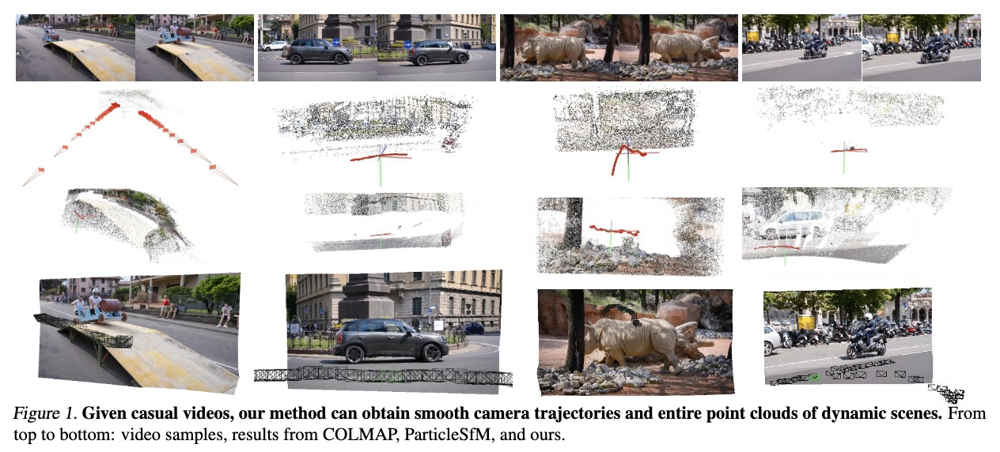
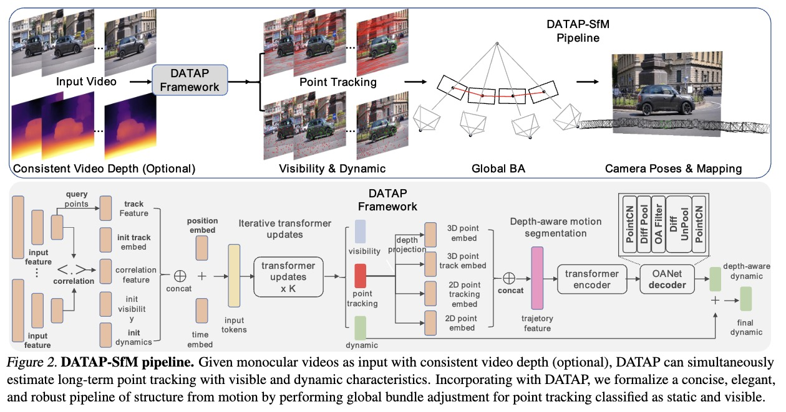
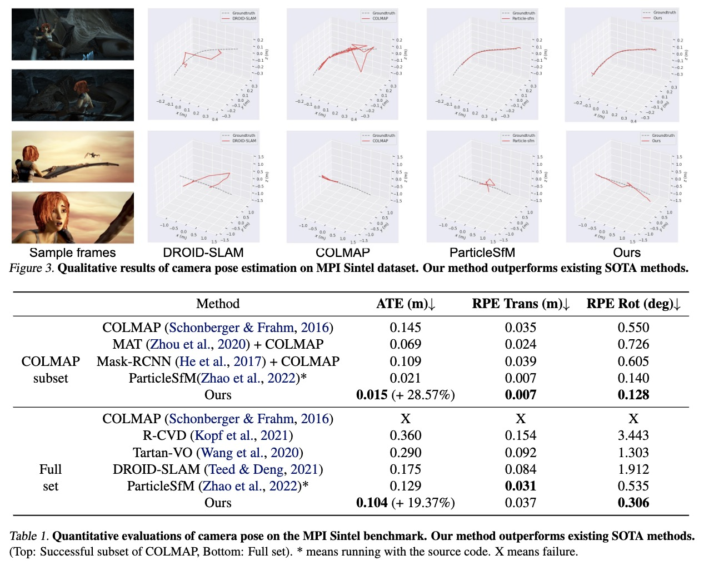

# DATAP-SfM
DATAP-SfM: Dynamic-Aware Tracking Any Point for Robust Dense Structure from Motion in the Wild

### [Project Page](https://zju3dv.github.io/DATAP-SfM/) | [Paper]()
<!-- Code is coming soon. -->

<br/>

> 

> [Weicai Ye](https://ywcmaike.github.io/), Xinyu Chen, Ruohao Zhan, Di Huang, Xiaoshui Huang, Haoyi Zhu, Hujun Bao, Wanli Ouyang, Tong He, Guofeng Zhang 

## Teaser



## Framework


## Results



## Brewing🍺, code coming soon.
## Citation

If you find this code useful for your research, please use the following BibTeX entry.

```bibtex
@article{Ye2024FedSurfGS,
          title={DATAP-SfM: Dynamic-Aware Tracking Any Point for Robust Dense Structure from Motion in the Wild},
          author={Weicai Ye and Xinyu Chen and Ruohao Zhan and Di Huang and Xiaoshui Huang and Haoyi Zhu and Hujun Bao and Wanli Ouyang and Tong He and Guofeng Zhang},
          booktitle={arxiv preprint},
          year={2024},
      }
      
```